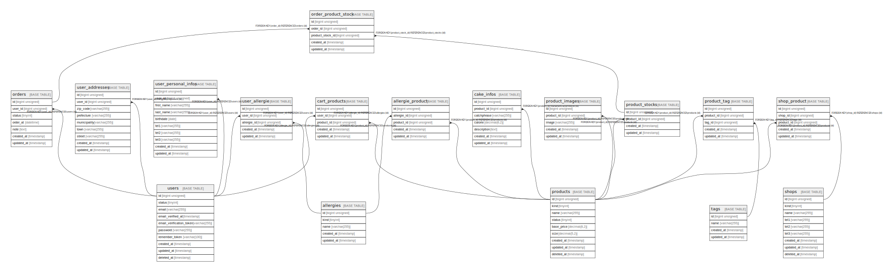

# laravel

## Tables

| Name | Columns | Comment | Type |
| ---- | ------- | ------- | ---- |
| [allergie_product](allergie_product.md) | 5 |  | BASE TABLE |
| [allergies](allergies.md) | 5 |  | BASE TABLE |
| [cake_infos](cake_infos.md) | 7 |  | BASE TABLE |
| [cart_products](cart_products.md) | 5 |  | BASE TABLE |
| [order_product_stock](order_product_stock.md) | 5 |  | BASE TABLE |
| [orders](orders.md) | 7 |  | BASE TABLE |
| [product_images](product_images.md) | 5 |  | BASE TABLE |
| [product_stocks](product_stocks.md) | 4 |  | BASE TABLE |
| [product_tag](product_tag.md) | 5 |  | BASE TABLE |
| [products](products.md) | 9 |  | BASE TABLE |
| [shop_product](shop_product.md) | 5 |  | BASE TABLE |
| [shops](shops.md) | 9 |  | BASE TABLE |
| [tags](tags.md) | 4 |  | BASE TABLE |
| [user_allergie](user_allergie.md) | 5 |  | BASE TABLE |
| [user_personal_infos](user_personal_infos.md) | 10 |  | BASE TABLE |
| [users](users.md) | 10 |  | BASE TABLE |

## Relations

---

> Generated by [tbls](https://github.com/k1LoW/tbls)
