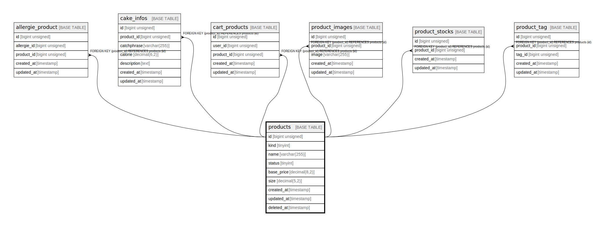

# products

## Description

<details>
<summary><strong>Table Definition</strong></summary>

```sql
CREATE TABLE `products` (
  `id` bigint unsigned NOT NULL AUTO_INCREMENT,
  `kind` tinyint NOT NULL,
  `name` varchar(255) COLLATE utf8mb4_unicode_ci NOT NULL,
  `status` tinyint NOT NULL,
  `base_price` decimal(8,2) NOT NULL,
  `size` decimal(5,2) NOT NULL,
  `created_at` timestamp NULL DEFAULT NULL,
  `updated_at` timestamp NULL DEFAULT NULL,
  `deleted_at` timestamp NULL DEFAULT NULL,
  PRIMARY KEY (`id`)
) ENGINE=InnoDB DEFAULT CHARSET=utf8mb4 COLLATE=utf8mb4_unicode_ci
```

</details>

## Columns

| Name | Type | Default | Nullable | Extra Definition | Children | Parents | Comment |
| ---- | ---- | ------- | -------- | ---------------- | -------- | ------- | ------- |
| id | bigint unsigned |  | false | auto_increment | [allergie_product](allergie_product.md) [cake_infos](cake_infos.md) [cart_products](cart_products.md) [product_images](product_images.md) [product_stocks](product_stocks.md) [product_tag](product_tag.md) |  |  |
| kind | tinyint |  | false |  |  |  |  |
| name | varchar(255) |  | false |  |  |  |  |
| status | tinyint |  | false |  |  |  |  |
| base_price | decimal(8,2) |  | false |  |  |  |  |
| size | decimal(5,2) |  | false |  |  |  |  |
| created_at | timestamp |  | true |  |  |  |  |
| updated_at | timestamp |  | true |  |  |  |  |
| deleted_at | timestamp |  | true |  |  |  |  |

## Constraints

| Name | Type | Definition |
| ---- | ---- | ---------- |
| PRIMARY | PRIMARY KEY | PRIMARY KEY (id) |

## Indexes

| Name | Definition |
| ---- | ---------- |
| PRIMARY | PRIMARY KEY (id) USING BTREE |

## Relations



---

> Generated by [tbls](https://github.com/k1LoW/tbls)
