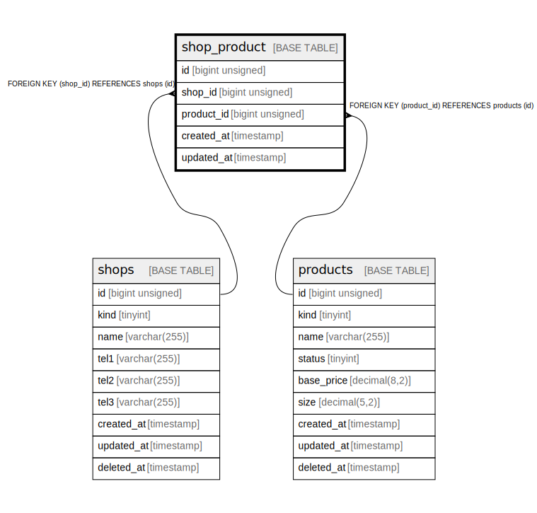

# shop_product

## Description

<details>
<summary><strong>Table Definition</strong></summary>

```sql
CREATE TABLE `shop_product` (
  `id` bigint unsigned NOT NULL AUTO_INCREMENT,
  `shop_id` bigint unsigned NOT NULL,
  `product_id` bigint unsigned NOT NULL,
  `created_at` timestamp NULL DEFAULT NULL,
  `updated_at` timestamp NULL DEFAULT NULL,
  PRIMARY KEY (`id`),
  KEY `shop_product_shop_id_foreign` (`shop_id`),
  KEY `shop_product_product_id_foreign` (`product_id`),
  CONSTRAINT `shop_product_product_id_foreign` FOREIGN KEY (`product_id`) REFERENCES `products` (`id`),
  CONSTRAINT `shop_product_shop_id_foreign` FOREIGN KEY (`shop_id`) REFERENCES `shops` (`id`)
) ENGINE=InnoDB DEFAULT CHARSET=utf8mb4 COLLATE=utf8mb4_unicode_ci
```

</details>

## Columns

| Name | Type | Default | Nullable | Extra Definition | Children | Parents | Comment |
| ---- | ---- | ------- | -------- | ---------------- | -------- | ------- | ------- |
| id | bigint unsigned |  | false | auto_increment |  |  |  |
| shop_id | bigint unsigned |  | false |  |  | [shops](shops.md) |  |
| product_id | bigint unsigned |  | false |  |  | [products](products.md) |  |
| created_at | timestamp |  | true |  |  |  |  |
| updated_at | timestamp |  | true |  |  |  |  |

## Constraints

| Name | Type | Definition |
| ---- | ---- | ---------- |
| PRIMARY | PRIMARY KEY | PRIMARY KEY (id) |
| shop_product_product_id_foreign | FOREIGN KEY | FOREIGN KEY (product_id) REFERENCES products (id) |
| shop_product_shop_id_foreign | FOREIGN KEY | FOREIGN KEY (shop_id) REFERENCES shops (id) |

## Indexes

| Name | Definition |
| ---- | ---------- |
| shop_product_product_id_foreign | KEY shop_product_product_id_foreign (product_id) USING BTREE |
| shop_product_shop_id_foreign | KEY shop_product_shop_id_foreign (shop_id) USING BTREE |
| PRIMARY | PRIMARY KEY (id) USING BTREE |

## Relations



---

> Generated by [tbls](https://github.com/k1LoW/tbls)
